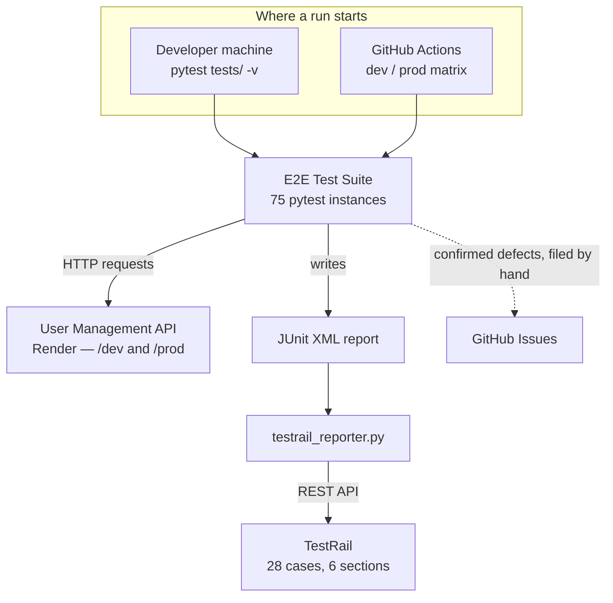
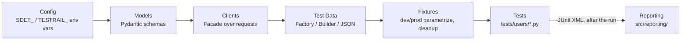
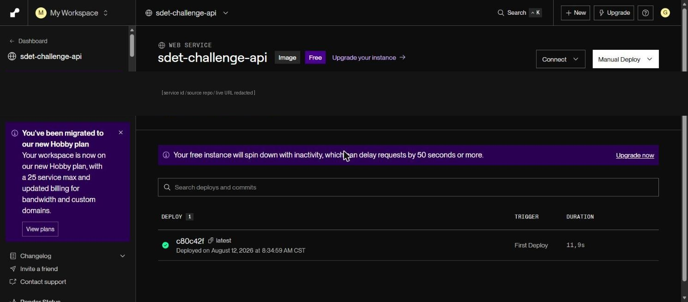
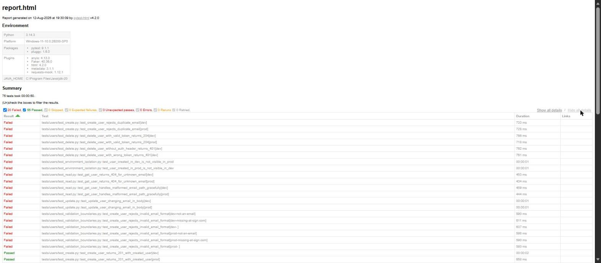
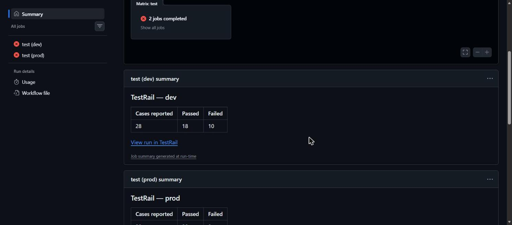
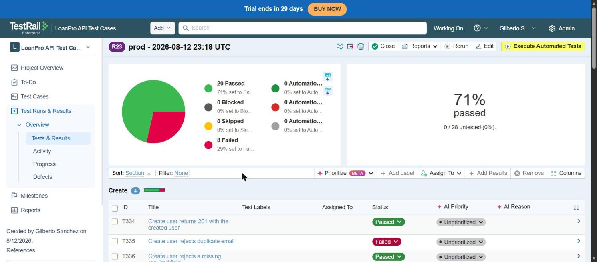

# SDET Home Challenge — User Management API

An automated end-to-end test framework for the User Management API, covering
CRUD operations, authentication, validation boundaries, and dev/prod
environment isolation. Tests run against the live API deployed on Render,
both locally and in CI.

The findings from this suite are documented as [GitHub Issues](https://github.com/gsanchezm/sdet-loanpro-challenge/issues?q=is%3Aissue+label%3Abug):
5 confirmed defects, each backed by reproduction steps and evidence captured
outside the test framework.

## Architecture

The framework is layered — read top to bottom as build order, each layer
building on the ones above it — and tests are organized as vertical slices
by capability (Create / Read / Update
/ Delete & Authentication / Validation Boundaries / Environment Isolation)
rather than by environment, so `dev` and `prod` share the same test code and
any divergence between them shows up as a failure, not a separate test file.
`src/reporting/` sits outside that chain entirely — it consumes the JUnit XML
pytest already produces, after the fact, rather than participating in test
execution (see "Test case management" below for why).



### Layers

- **Config** (`src/config/`) — two `pydantic-settings` classes, `Settings`
  (`SDET_*` env vars, for the API under test) and `TestRailSettings`
  (`TESTRAIL_*` env vars, for reporting). Both declare `extra="ignore"`
  because they read from the same local `.env` file and would otherwise
  reject each other's keys.
- **Models** (`src/models/user.py`) — Pydantic schemas (a shared
  `UserPayload` base, `User`, `CreateUserRequest`, `UpdateUserRequest`,
  `ErrorResponse`) mirroring the OpenAPI spec. `User.model_validate(...)`
  validates success-response bodies in `test_create.py`, `test_read.py`, and
  `test_update.py`; `ErrorResponse.model_validate(...)` validates the shared
  error shape in `test_validation_boundaries.py`. `CreateUserRequest`/
  `UpdateUserRequest` document the request schemas but are deliberately not
  used for response validation.
- **Clients** (`src/clients/`) — a Facade over `requests`: `BaseClient` is a
  thin `requests.Session` wrapper (`get`/`post`/`put`/`delete`), `UsersClient`
  is the domain-specific surface built on top of it (`create_user`,
  `get_user`, `delete_user`, ...). Tests never call `requests` directly.
- **Test data** (`src/factories/`, `src/data/`) — a Factory
  (`UserFactory.valid_payload()`, randomized valid data via `Faker`) and a
  Builder (`UserPayloadBuilder`, a fluent API for constructing intentionally
  invalid or edge-case payloads: `.without_field()`, `.with_extra_field()`,
  `.with_age(151)`, ...), plus a data-driven layer — literal boundary values
  live in `tests/data/parametrize_data.json`, loaded through
  `src/data/loader.py` rather than hardcoded in `@pytest.mark.parametrize`.
- **Fixtures** (`tests/conftest.py`) — `pytest_generate_tests` auto-
  parametrizes any test that requests `users_client` across `dev`/`prod` (or
  a subset, via `TEST_ENVIRONMENTS`); `created_user_cleanup` tears down data
  each test creates, and a session-scoped autouse sweep cleans up before the
  session's first test, recovering from a prior crashed run.
- **Tests** (`tests/users/`) — one file per capability. These are
  characterization/contract tests: assertions encode what the OpenAPI spec
  documents, not what the API currently does. A failing test that correctly
  exposes a real defect is left failing and documented as a GitHub Issue —
  the assertion is never loosened to make the suite green.
- **Reporting** (`src/reporting/`) — decoupled from the layers above; see
  "Test case management" below.



### Design patterns and principles

This section is split into three groups: **design patterns** are structural
(how objects collaborate), **principles** are cross-cutting engineering
habits applied throughout the codebase, and **testing techniques** are
decisions specific to how the test suite itself is built.

#### Design patterns

- **Facade** — `BaseClient`/`UsersClient` (`src/clients/`) hide HTTP/
  `requests` details behind a small, domain-specific API. Tests call
  `users_client.create_user(payload)`, never `requests.post(...)` directly.
- **Factory** — `UserFactory` (`src/factories/user_factory.py`) produces
  randomized valid payloads on demand via `Faker`.
- **Builder** — `UserPayloadBuilder` (`src/factories/user_factory.py`)
  fluently constructs payloads that deviate from valid in exactly one
  dimension (`.without_field()`, `.with_extra_field()`, `.with_age(151)`),
  so each negative test only has to state the deviation under test.

#### Principles

- **Guard clauses over branching** — the codebase avoids `if`/`else`
  branching statements, preferring early `return`/`continue` and dict/map
  lookups (e.g. `STATUS_ID = {True: 1, False: 5}` in
  `src/reporting/testrail_reporter.py`) over multi-branch conditionals. See
  `tests/conftest.py`'s `_active_environments()` and
  `src/reporting/case_sync.py`'s `_sync_one_case()` for more examples.
- **Single source of truth (DRY)** — `tests/data/testrail_cases.json` (the
  case catalog) and `tests/data/testrail_case_ids.json` (the generated
  function → case-id map) are read by both `case_sync.py` and
  `testrail_reporter.py`; neither script duplicates the other's data. The
  `UserPayload` base model (`src/models/user.py`) is the single definition
  of `name`/`email`/`age`, shared by `User`, `CreateUserRequest`, and
  `UpdateUserRequest` — the latter two are defined for documentation
  purposes only (they mirror the request schemas) and aren't instantiated
  anywhere in the suite.
- **Idempotency** — `case_sync.py` matches existing TestRail sections/cases
  by exact name/title before creating anything, so re-running it is safe.
- **Test isolation and cleanup discipline** — every test that creates data
  cleans it up itself (fixture, explicit delete, or `try`/`finally`); the
  session-scoped sweep in `tests/conftest.py` is the safety net for whatever
  a normal test run doesn't catch (e.g. a prior crashed run).
- **Fail fast on misconfiguration** — `tests/conftest.py` rejects an invalid
  `TEST_ENVIRONMENTS` value immediately instead of silently running against
  a wrong or empty environment set; `TestRailClient.get_default_suite_id`
  raises a clear error instead of an `IndexError` if a TestRail project has
  no suites.

#### Testing techniques

- **Data-driven testing (DDT)** — parametrize values live in JSON
  (`tests/data/parametrize_data.json`), loaded through
  `src.data.loader.load_dataset` instead of being hardcoded in
  `@pytest.mark.parametrize`; adding a boundary value is a data edit, not a
  code change.
- **Contract/characterization testing** — the suite asserts the documented
  contract, not observed behavior. This is deliberate: the whole point of
  the suite is to surface where the real API diverges from its own spec. The
  handful of tests that intentionally accept more than one outcome (because
  the spec itself is ambiguous, or the point is to characterize real
  behavior rather than enforce a single result) are marked
  `@pytest.mark.characterization`, so they can be run or excluded on their
  own: `pytest -m characterization` / `pytest -m "not characterization"`.
- **Response schema validation** — beyond individual field checks
  (`assert body["email"] == ...`), success responses are validated against
  the `User` Pydantic model and error responses against `ErrorResponse`, so a
  missing field or a value that can't be coerced to the declared type fails
  the test even if every individually-checked field happens to be correct.

### Tech stack

| Tool                              | Role in this project                                                                                                                     |
|------------------------------------|---------------------------------------------------------------------------------------------------------------------------------------|
| **Python 3.11+**                   | Language runtime for the whole framework.                                                                                               |
| **pytest**                         | Test runner and fixture engine — drives `dev`/`prod` parametrization (`pytest_generate_tests`), cleanup fixtures, and markers.          |
| **requests**                       | HTTP client underlying the Facade clients (`BaseClient`/`UsersClient` in `src/clients/`); tests never call it directly.                 |
| **pydantic / pydantic-settings v2**| Response/schema validation (`User`, `ErrorResponse` models in `src/models/`) and typed, `.env`-backed configuration (`Settings`, `TestRailSettings`). |
| **email-validator**                | Backs pydantic's `EmailStr` field type, used to validate the `email` field on every user payload.                                       |
| **Faker**                          | Generates randomized valid test data (`UserFactory.valid_payload()`).                                                                   |
| **pytest-html**                    | Produces the self-contained HTML test report (`--html=reports/report.html --self-contained-html`), locally and in CI.                   |
| **GitHub Actions**                 | CI — runs the suite on every push/PR as a parallel `dev`/`prod` matrix and uploads JUnit/HTML report artifacts.                          |
| **TestRail API v2**                | Test case management and results reporting, called directly via `src/reporting/` — no pytest plugin in between.                         |

No pytest plugins or hooks are used for reporting — `src/reporting/` is
plain scripts that parse JUnit XML and call TestRail's REST API directly.

## Prerequisites

- Python 3.11+
- Access to the deployed API base URL and a valid auth token

## Install

```bash
pip install -e ".[dev]"
```

This installs the project itself plus the test/dev dependencies (`pytest`,
`pytest-html`, `Faker`) declared in `pyproject.toml`.

## Configuration

The suite reads its target environment from two environment variables:

| Variable               | Description                                                        |
|-------------------------|---------------------------------------------------------------------|
| `SDET_RENDER_BASE_URL`  | Base URL of the deployed API (e.g. `https://your-service.onrender.com`) |
| `SDET_AUTH_TOKEN`       | Token sent as the `Authentication` header for authenticated requests |

Copy `.env.example` to `.env` and fill in the real values:

```bash
cp .env.example .env
```

`src/config/settings.py` loads these via `pydantic-settings`, so a local
`.env` file is picked up automatically — no need to export the variables by
hand.

The API exposes two isolated environments, `dev` and `prod`, as path
prefixes under the same base URL (`{base_url}/dev/users`,
`{base_url}/prod/users`). By default the suite runs every test against both.
To restrict a run to one environment, set `TEST_ENVIRONMENTS`:

```bash
TEST_ENVIRONMENTS=dev pytest tests/ -v
```

The API under test is deployed as a Docker image on [Render](https://render.com):



## Test data

Boundary ages, invalid emails, and missing-field names live in
[`tests/data/parametrize_data.json`](tests/data/parametrize_data.json) (see
"Data-driven testing" above) — edit the JSON file to add a new boundary
value, no test code changes needed.

## Running the suite locally

```bash
pytest tests/ -v
```

Useful variations:

```bash
# Run a single suite
pytest tests/users/test_delete.py -v

# Generate JUnit + self-contained HTML reports, same as CI
pytest tests/ --junitxml=reports/junit.xml --html=reports/report.html --self-contained-html
```

The self-contained HTML report from the last local run — 75 tests, 20 failed
(the 5 known bugs) / 55 passed:



A session-scoped, autouse fixture in `tests/conftest.py` sweeps both `dev`
and `prod` for leftover `qa-*` test users at the start of every run, so the
suite is safe to re-run without manual cleanup. Any invocation of pytest
against this repo needs `SDET_RENDER_BASE_URL`/`SDET_AUTH_TOKEN` set and
makes live requests to both environments before the first test executes.

Individual tests clean up whatever users they create — via the
`created_user_cleanup` fixture, an explicit `delete_user` call as part of
the test itself, or a `try`/`finally` block in the environment-isolation
suite — so a normal test run should not leave data behind in either
environment.

## Continuous integration

`.github/workflows/ci.yml` runs the full suite on every push and pull
request to `main` (and on manual dispatch). It uses a matrix of
`environment: [dev, prod]` so the two environments run as separate,
parallel jobs with `fail-fast: false` — a failure in one does not cancel the
other, and both report independently. Each job:

1. Waits for the Render service to become reachable (Render's free tier
   spins down on inactivity, so the first request can take a while).
2. Runs `pytest tests/` for its environment, producing a JUnit XML and a
   self-contained HTML report under `reports/`.
3. Uploads both reports as build artifacts via `actions/upload-artifact`,
   using `if: always()` so the reports are published even when tests fail.
4. Reports results to TestRail (`if: always()`, skipped if
   `TESTRAIL_API_KEY` isn't configured) — see Test case management below.

A recent run — both `dev` and `prod` legs failing exactly where the 5 known
bugs predict, with each job's step summary linking to the TestRail run it
just created:



There is deliberately no `continue-on-error` anywhere in the pipeline: the
API has confirmed bugs (see [Known bugs](#known-bugs)), and the pipeline is
expected to report red until those are fixed. Suppressing that failure would
defeat the purpose of the suite.

The workflow sets `SDET_RENDER_BASE_URL` and `SDET_AUTH_TOKEN` from a
repository variable and secret named `RENDER_BASE_URL` and `AUTH_TOKEN`
respectively (`vars.RENDER_BASE_URL`, `secrets.AUTH_TOKEN` in `ci.yml`) —
note these names do **not** carry the `SDET_` prefix used locally. Both must
be configured under the repository's Settings → Secrets and variables →
Actions for the workflow to run against a real deployment.

The TestRail integration needs its own configuration: `TESTRAIL_BASE_URL`,
`TESTRAIL_USERNAME`, and `TESTRAIL_PROJECT_ID` as repository variables, and
`TESTRAIL_API_KEY` as a repository secret, for the "Report results to
TestRail" step (step 4 above) to run — it's automatically skipped otherwise.

## Test case management

The project lives in [TestRail](https://loanpro.testrail.io/index.php?/projects/overview/2)
(private — requires an account on this TestRail instance to open; the
screenshots below are the public evidence of what it contains).

Test names read cleanly as TestRail case titles, grouped by capability
(Create / Delete & Authentication / Environment Isolation / Read / Update /
Validation Boundaries) rather than by environment. The 75 pytest instances
(parametrized by `dev`/`prod` and, for the data-driven suites, by value) roll
up to 28 TestRail cases — the catalog lives in
[`tests/data/testrail_cases.json`](tests/data/testrail_cases.json).

Each catalog entry also carries `preconditions`, `steps`, and
`expected_result` — the case's Preconditions/Steps/Expected Result fields in
TestRail, derived from what the corresponding test function actually does
(including the real endpoint, payload, and any parametrized data values), so
a case reads as a standalone test case even outside this repo, not just a
bare title.

`src/reporting/case_sync.py` is an idempotent, re-runnable script (it matches
by exact section name / case title, so renaming an entry in
`testrail_cases.json` creates a new case rather than renaming the existing
one) that creates the sections/cases in TestRail from that catalog, writes
the resulting `function -> case_id` map to
[`tests/data/testrail_case_ids.json`](tests/data/testrail_case_ids.json), and
pushes each entry's preconditions/steps/expected result to TestRail —
including for cases that already exist, so editing the catalog's text and
re-running keeps TestRail in sync. Run it again whenever the catalog changes.
Note that `testrail_case_ids.json` pins case ids to this specific TestRail
project, so anyone reusing this repo against their own TestRail account
needs to run `case_sync.py` first to generate their own id mapping:

```bash
python -m src.reporting.case_sync
```

`src/reporting/testrail_reporter.py` runs as the last step of every CI job
(`if: always()`, skipped if TestRail isn't configured — see Continuous
integration above): it parses that job's JUnit XML, rolls each function's
`dev`/`prod`/data-driven variants up into one result per case, creates a new
TestRail Run, and posts the results — a case is Failed if any of its variants
failed, with a comment listing every variant's outcome. Required env vars:
`TESTRAIL_BASE_URL`, `TESTRAIL_USERNAME`, `TESTRAIL_API_KEY`,
`TESTRAIL_PROJECT_ID` (see `.env.example`).

A run in TestRail, populated automatically by the CI job above — cases
grouped by section, each with a real Passed/Failed result:



## Known bugs

Bugs found while building and running this suite are documented as
[GitHub Issues](https://github.com/gsanchezm/sdet-loanpro-challenge/issues?q=is%3Aissue+label%3Abug),
each with the affected endpoint, expected vs. actual behavior, direct
reproduction evidence, and the test that exposes it.

## Project structure

```
src/
  clients/
    base_client.py       # thin requests.Session wrapper (get/post/put/delete)
    users_client.py       # Users API surface built on top of base_client
  config/
    settings.py           # pydantic-settings config (SDET_ env vars, .env support)
    testrail_settings.py  # pydantic-settings config (TESTRAIL_ env vars)
  data/
    loader.py              # loads tests/data/parametrize_data.json (lru_cache'd)
  factories/
    user_factory.py       # UserFactory (random valid payloads) and
                           # UserPayloadBuilder (fluent builder for edge cases)
  models/
    user.py                # UserPayload base + User / CreateUserRequest / UpdateUserRequest / ErrorResponse
  reporting/
    testrail_client.py     # thin TestRail API v2 client (sections/cases/runs)
    case_sync.py            # syncs tests/data/testrail_cases.json catalog to TestRail
    junit_parser.py         # parses JUnit XML, groups results by function
    testrail_reporter.py    # posts per-case results to TestRail after each CI job

tests/
  conftest.py              # env-parametrized users_client fixture, cleanup fixtures
  data/
    parametrize_data.json    # boundary/invalid values loaded by src.data.loader
    testrail_cases.json      # catalog of 28 TestRail cases (section + title per function)
    testrail_case_ids.json   # function -> case_id map, written by case_sync.py
  users/
    test_create.py                  # POST /users
    test_read.py                    # GET /users, GET /users/{email}
    test_update.py                  # PUT /users/{email}
    test_delete.py                  # DELETE /users/{email} and auth enforcement
    test_validation_boundaries.py   # field validation and boundary values
    test_environment_isolation.py   # dev/prod data isolation and parity

.github/workflows/ci.yml   # parallel dev/prod CI pipeline
docs/screenshots/          # Render, GitHub Actions, TestRail, pytest-html evidence
.env.example                 # template for required environment variables
pyproject.toml               # project metadata, dependencies, pytest config
```
